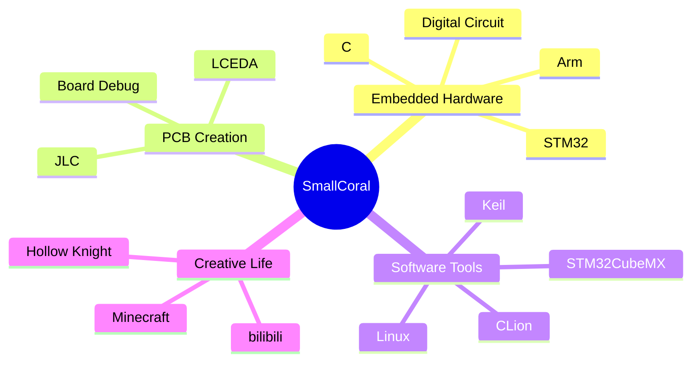
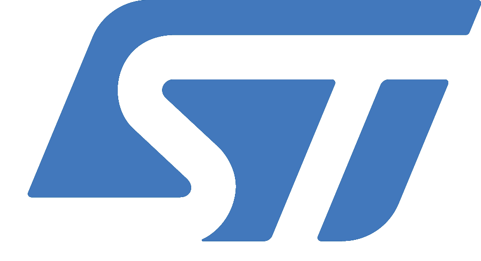
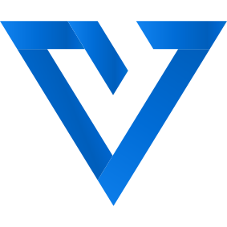

[][smallcoral]

---

## ⚡ About Me

<table>
  <tr>
    <td width="50%" valign="top">
      <h3><code>whoami</code></h3>
      <ul>
        <li>🏫 University student, currently growing through hardware and code.</li>
        <li>👀 Main interest: embedded hardware and board-level creation.</li>
        <li>🌱 Current learning track: C, STM32, PCB, Arm, electronics and Linux.</li>
        <li>🥅 Goal: learn more deeply and build more solid embedded projects.</li>
        <li>💞️ Looking to collaborate around JLC / 嘉立创 ecosystem.</li>
        <li>🎮 Favorite games: Minecraft and Hollow Knight.</li>
      </ul>
    </td>
    <td width="50%" valign="top">
      <h3><code>current signal</code></h3>
      <pre><code>Role        Embedded hardware learner
Stack       C / STM32 / PCB / Arm / Linux
Tools       CLion / Keil / CubeMX / LCEDA
Timezone    Asia/Shanghai
Contact     Shan_Hu_MC@outlook.com</code></pre>
    </td>
  </tr>
</table>

---

## 🧩 Core Stack

---

## 🛠️ Lab Tools

  
  &nbsp;&nbsp;
  
  &nbsp;&nbsp;
  
  &nbsp;&nbsp;
  
  &nbsp;&nbsp;
  
  &nbsp;&nbsp;
  
  &nbsp;&nbsp;
  
  &nbsp;&nbsp;
  
  &nbsp;&nbsp;
  
  &nbsp;&nbsp;
  
  &nbsp;&nbsp;
  

---

## 🌐 Connect

[][bilibili]
[][csdn]
[][jlc]
[][steam]

---

## 📊 GitHub Dashboard

  
  
   
  
   
  

---

README redesigned on 2026-05-11 · Activity snapshot: 2025-05-02 15:13:12 UTC

[smallcoral]: https://smallcoral.github.io
[bilibili]: https://space.bilibili.com/517434964?spm_id_from=333.1365.0.0
[csdn]: https://blog.csdn.net/Shan_Hu_MC?utm_source=app&app_version=6.5.6
[jlc]: https://oshwhub.com/smallcoral/works
[steam]: https://steamcommunity.com/id/smallcoral
